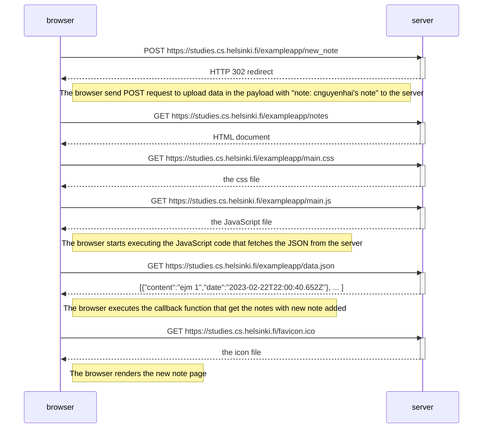

New note diagram:

```mermaid
sequenceDiagram
    participant browser
    participant server
    
    browser->>server: POST https://studies.cs.helsinki.fi/exampleapp/new_note
    activate server
    server-->>browser: HTTP 302 redirect
    deactivate server

    Note right of browser: The browser send POST request to upload data in the payload with "note: cnguyenhai's note" to the server

    browser->>server: GET https://studies.cs.helsinki.fi/exampleapp/notes
    activate server
    server-->>browser: HTML document
    deactivate server

    browser->>server: GET https://studies.cs.helsinki.fi/exampleapp/main.css
    activate server
    server-->>browser: the css file
    deactivate server

    browser->>server: GET https://studies.cs.helsinki.fi/exampleapp/main.js
    activate server
    server-->>browser: the JavaScript file
    deactivate server 
    
    Note right of browser: The browser starts executing the JavaScript code that fetches the JSON from the server 
    
    browser->>server: GET https://studies.cs.helsinki.fi/exampleapp/data.json
    activate server
    server-->>browser: [{"content":"ejm 1","date":"2023-02-22T22:00:40.652Z"}, ... ]
    deactivate server

    Note right of browser: The browser executes the callback function that get the notes with new note added    

    browser->>server: GET https://studies.cs.helsinki.fi/favicon.ico
    activate server
    server-->>browser: the icon file
    deactivate server

    Note right of browser: The browser renders the new note page
```