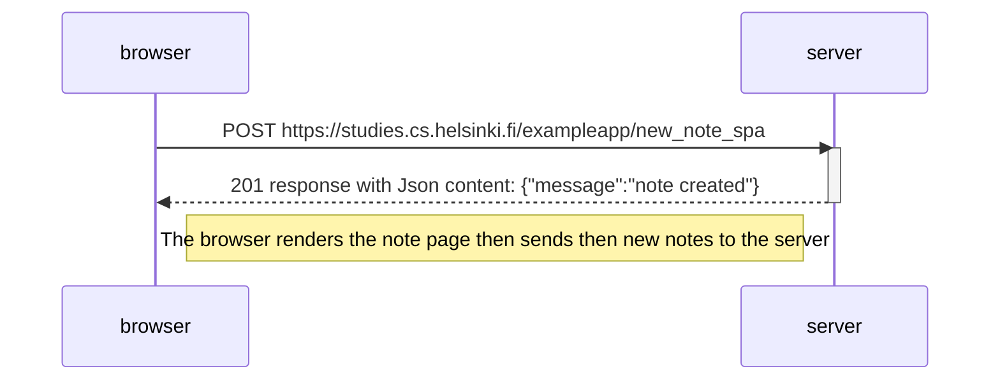

Single-page app new notes diagram:

```mermaid
sequenceDiagram
    participant browser
    participant server
    
    browser->>server: POST https://studies.cs.helsinki.fi/exampleapp/new_note_spa
    activate server
    server-->>browser: 201 response with Json content: {"message":"note created"}
    deactivate server

    Note right of browser: The browser renders the note page then sends then new notes to the server
```